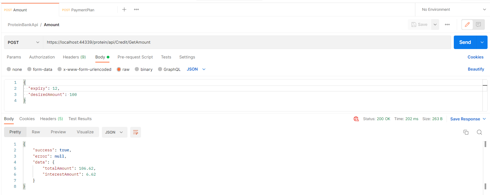
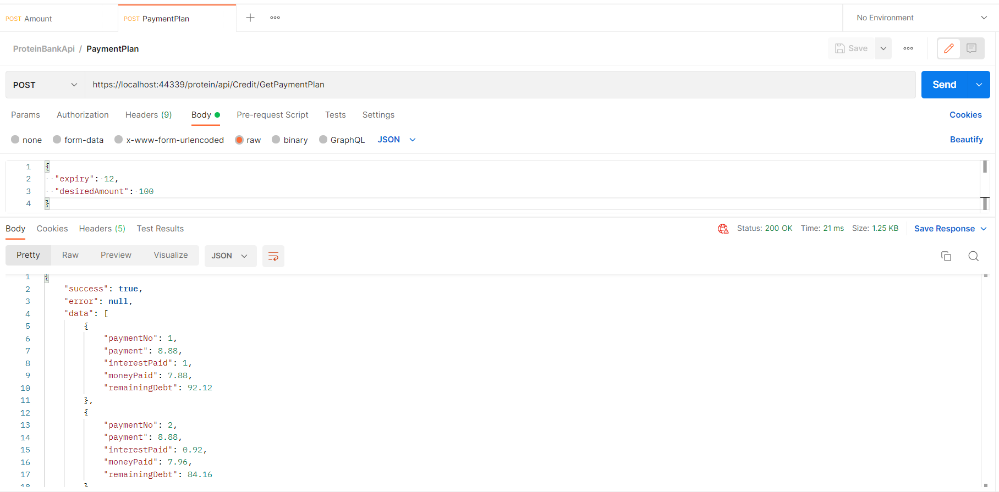
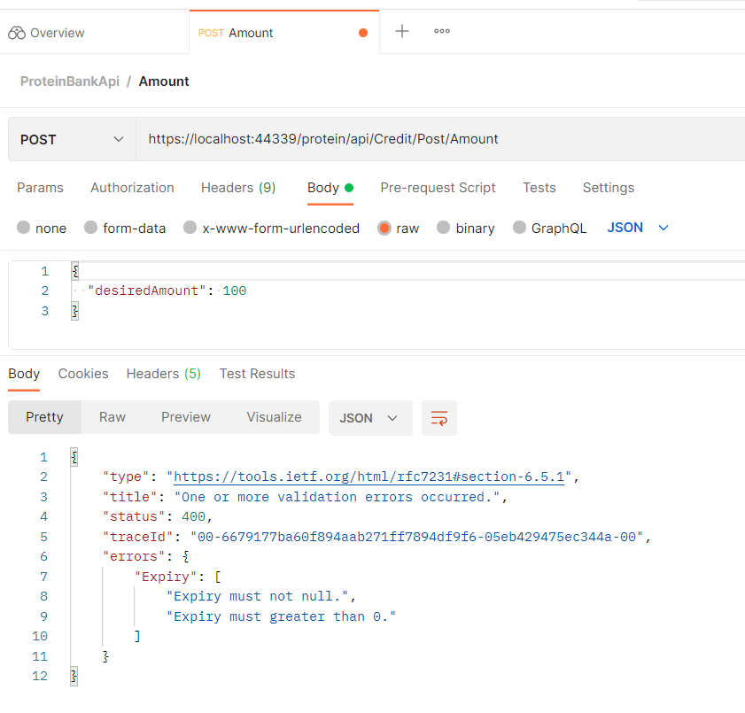
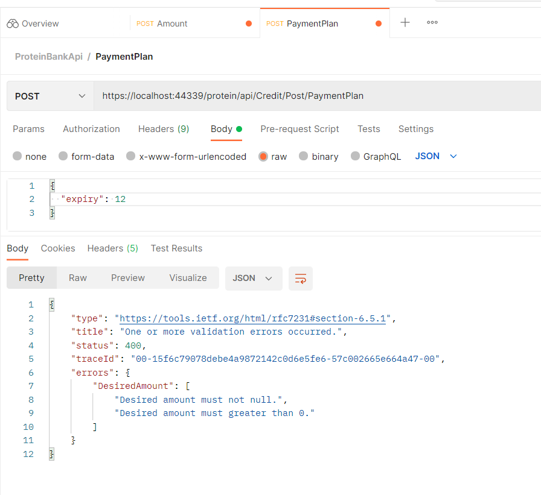

# 1-Hafta-Odev

Bu proje istenilen kredi tutarını ve vade miktarını request olarak alıp ödenecek tutarı ve detaylı ödeme planını
response olarak dönen bir WebApi projesidir.
Ödevde istenen iki işlemi gerçekleştiren controller oluşturuldu. FluentValidation kullanılarak gerekli validasyonlar yazıldı.
Aşağıda postman üzerinde yapılan testlerin ekran görüntüleri bulunmaktadır.

## Ekran Görüntüleri

    Validation:

